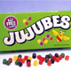
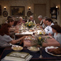
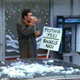

## Welcome!

Seinfeld ran for nine seasons on NBC and became famous as a “show about
nothing.” Basically, the show allows viewers to follow the antics of Jerry,
George, Elaine, and Kramer as they move through their daily lives, often
encountering interesting people or dealing with special circumstances.

It is the simplicity of Seinfeld that makes it so appropriate for use in
economics courses. Using these clips (as well as clips from other television
shows or movies) makes economic concepts come alive, making them more real for
students. Ultimately, students will start seeing economics everywhere – in other
TV shows, in popular music, and most importantly, in their own lives.

We hope that you find these clips valuable and would appreciate your feedback.

### [The Barber](/clip/44/)

[competition](/concept/competition_1/)

### [The Andrea Doria](/clip/81/)

[incentives](/concept/incentives/)

### [The Apartment](/clip/13/)

[signaling](/concept/signaling/)

### [The Alternate Side](/clip/23/)

[imperfect information](/concept/imperfect-information/) | [moral hazard](/concept/moral-hazard/)

### [The Apartment](/clip/12/)

[price ceiling](/concept/price-ceiling/) | [rationing mechanisms](/concept/rationing-mechanisms/)

### [The Baby Shower](/clip/7/)

[cost-benefit analysis](/concept/cost-benefit-analysis/) | [economics of crime](/concept/economics-of-crime/) | [incentives](/concept/incentives/) | [thinking at the margin](/concept/thinking-at-the-margin/)

### [The Barber](/clip/45/)

[cost-benefit analysis](/concept/cost-benefit-analysis/) | [dominant strategy](/concept/dominant-strategy/) | [game theory](/concept/game-theory/)

### [The Cafe](/clip/20/)

[free entry and exit](/concept/free-entry-and-exit/)

### [The Cafe](/clip/21/)

[free entry and exit](/concept/free-entry-and-exit/) | [monopolistic competition](/concept/monopolistic-competition/) | [product differentiation](/concept/product-differentiation/)

### [The Bottle Deposit](/clip/76/)

[arbitrage](/concept/arbitrage/) | [fixed costs](/concept/fixed-costs/) | [incentives](/concept/incentives/) | [variable costs](/concept/variable-costs/)

### [The Bris](/clip/43/)

[compensating differentials](/concept/compensating-differentials/) | [labor market](/concept/labor-market/)

### [The Calzone](/clip/75/)

[altruism](/concept/altruism/) | [incentives](/concept/incentives/) | [utility](/concept/utility/)

### [The Chaperone](/clip/55/)

[functions of markets](/concept/functions-of-markets/) | [scarcity](/concept/scarcity/) | [zero-sum game](/concept/zero-sum-game/)

### [The Chinese Woman](/clip/58/)

[change in technology](/concept/change-in-technology/) | [innovation](/concept/innovation/)

### [The Chinese Restaurant](/clip/9/)

[opportunity cost](/concept/opportunity-cost/)

### [The Chinese Restaurant](/clip/10/)

[opportunity cost](/concept/opportunity-cost/) | [rationing mechanisms](/concept/rationing-mechanisms/)

### [The Chinese Restaurant](/clip/11/)

[efficiency](/concept/efficiency/) | [rationing mechanisms](/concept/rationing-mechanisms/)

### [The Cheever Letters](/clip/31/)

[black market](/concept/black-market/) | [gains from exchange](/concept/gains-from-exchange/)

### [The Cheever Letters](/clip/32/)

[common resource](/concept/common-resource/)

### [The Cheever Letters](/clip/30/)

[unintended consequences](/concept/unintended-consequences/)

### [The Chicken Roaster](/clip/84/)

[cost-benefit analysis](/concept/cost-benefit-analysis/) | [externality](/concept/externality/)

### [The Engagement](/clip/64/)

[externality](/concept/externality/) | [incentives](/concept/incentives/) | [property rights](/concept/property-rights/)

### [The Finale](/clip/90/)

[changes in payoffs](/concept/changes-in-payoffs/) | [game theory](/concept/game-theory/) | [incentives](/concept/incentives/)

### [The Foundation](/clip/79/)

[cartel](/concept/cartel/) | [collusion](/concept/collusion/)

### [The Foundation](/clip/78/)

[economies of scale](/concept/economies-of-scale/)

### [The Contest](/clip/34/)

[cost-benefit analysis](/concept/cost-benefit-analysis/) | [rate of time preference](/concept/rate-of-time-preference/)

### [The Couch](/clip/59/)

[demand](/concept/demand/) | [substitutes](/concept/substitutes/)

### [The Deal](/clip/16/)

[deadweight loss of gift-giving](/concept/deadweight-loss-of-gift-giving/) | [signaling](/concept/signaling/) | [utility](/concept/utility/)

### [The Deal](/clip/15/)

[opportunity cost](/concept/opportunity-cost/) | [trade-off](/concept/trade-off/)

### [The Invitations](/clip/77/)

[credible threat](/concept/credible-threat/) | [signaling](/concept/signaling/) | [strategic move](/concept/strategic-move/)

### [The Jacket](/clip/8/)

[luxury goods](/concept/luxury-goods/)

### [The Fusilli Jerry](/clip/62/)

[intellectual property rights](/concept/intellectual-property-rights/)

### [The Fusilli Jerry](/clip/63/)

[asymmetric information](/concept/asymmetric-information/) | [moral hazard](/concept/moral-hazard/)

### [The Glasses](/clip/42/)

[demand](/concept/demand/)

### [The Good Samaritan](/clip/26/)

[externality](/concept/externality/)

### [The Hamptons](/clip/53/)

[common resource](/concept/common-resource/)

### [The Marine Biologist](/clip/50/)

[diversification](/concept/diversification/)

### [The Little Jerry](/clip/82/)

[reputation effects](/concept/reputation-effects/) | [willingness to pay](/concept/willingness-to-pay/)

### [The Robbery](/clip/4/)

[game theory](/concept/game-theory/) | [randomized strategies](/concept/randomized-strategies/)

### [The Marine Biologist](/clip/48/)

[depreciation of capital](/concept/depreciation-of-capital/)

### [The Keys](/clip/27/)

[unlimited wants](/concept/unlimited-wants/)

### [The Kiss Hello](/clip/61/)

[compound interest](/concept/compound-interest/) | [future value](/concept/future-value/) | [present value](/concept/present-value/)

### [The Maestro](/clip/66/)

[barriers to entry](/concept/barriers-to-entry/) | [monopoly power](/concept/monopoly-power/)

### [The Mango](/clip/37/)

[consumer sovereignty](/concept/consumer-sovereignty/)

### [The Marine Biologist](/clip/49/)

[non-price competition](/concept/non-price-competition/) | [regulated prices](/concept/regulated-prices/)

### [The Non-Fat Yogurt](/clip/46/)

[demand](/concept/demand/) | [value of information](/concept/value-of-information/)

### [The Nose Job](/clip/22/)

[commitment device](/concept/commitment-device/) | [game theory](/concept/game-theory/) | [trade-off](/concept/trade-off/)

### [The Note](/clip/18/)

[change in demand](/concept/change-in-demand/) | [change in supply](/concept/change-in-supply/) | [movement along a demand curve](/concept/movement-along-a-demand-curve/) | [movement along a supply curve](/concept/movement-along-a-supply-curve/)

### [The Old Man](/clip/35/)

[demand](/concept/demand/)

### [The Muffin Tops](/clip/86/)

[bads](/concept/bads/) | [complements](/concept/complements/) | [substitutes](/concept/substitutes/)

### [The Muffin Tops](/clip/85/)

[innovation](/concept/innovation/) | [intellectual property rights](/concept/intellectual-property-rights/)

### [The Opera](/clip/33/)

[black market](/concept/black-market/) | [gains from exchange](/concept/gains-from-exchange/)

### [The Pez Dispenser/The Pick (Part II)](/clip/92/)

[entrepreneurship](/concept/entrepreneurship/) | [intellectual property rights](/concept/intellectual-property-rights/) | [trade-off](/concept/trade-off/)

### [The Opposite](/clip/54/)

[sunk cost](/concept/sunk-cost/) | [thinking at the margin](/concept/thinking-at-the-margin/)

### [The Parking Garage](/clip/19/)

[competition](/concept/competition_1/) | [cost-benefit analysis](/concept/cost-benefit-analysis/) | [rationality](/concept/rationality/)

### [The Parking Space](/clip/38/)

[common resource](/concept/common-resource/) | [non-excludable goods](/concept/non-excludable-goods/) | [property rights](/concept/property-rights/) | [rival goods](/concept/rival-goods/)

### [The Pez Dispenser](/clip/25/)

[dominant strategy](/concept/dominant-strategy/) | [game theory](/concept/game-theory/)

### [The Pez Dispenser/The Pick (Part I)](/clip/91/)

[entrepreneurship](/concept/entrepreneurship/) | [intellectual property rights](/concept/intellectual-property-rights/) | [trade-off](/concept/trade-off/)

### [The Postponement](/clip/65/)

[demand](/concept/demand/) | [law of demand](/concept/law-of-demand/)

### [The Revenge](/clip/39/)

[unemployment](/concept/unemployment/)

### [The Robbery](/clip/3/)

[inferior good](/concept/inferior-good/) | [normal good](/concept/normal-good/)

### [The Pitch](/clip/28/)

[asymmetric information](/concept/asymmetric-information/)

### [The Pledge Drive](/clip/56/)

[free rider](/concept/free-rider/) | [public good](/concept/public-good/)

### [The Pledge Drive](/clip/57/)

[bandwagon effect](/concept/bandwagon-effect/)

### [The Pony Remark](/clip/6/)

[price ceiling](/concept/price-ceiling/) | [rationing mechanisms](/concept/rationing-mechanisms/)

### [The Soul Mate](/clip/80/)

[commitment device](/concept/commitment-device/) | [game theory](/concept/game-theory/)

### [The Soup Nazi](/clip/67/)

[barriers to entry](/concept/barriers-to-entry/) | [monopoly power](/concept/monopoly-power/)

### [The Rye](/clip/70/)

[willingness to pay](/concept/willingness-to-pay/) | [willingness to sell](/concept/willingness-to-sell/)

### [The Showerhead](/clip/71/)

[law of demand](/concept/law-of-demand/)

### [The Showerhead](/clip/72/)

[black market](/concept/black-market/) | [regulation](/concept/regulation/)

### [The Sponge](/clip/69/)

[change in demand](/concept/change-in-demand/) | [expectations](/concept/expectations/)

### [The Sponge](/clip/68/)

[opportunity cost](/concept/opportunity-cost/) | [scarcity](/concept/scarcity/) | [trade-off](/concept/trade-off/)

### [The Stakeout](/clip/2/)

[Coase theorem](/concept/coase-theorem/) | [externality](/concept/externality/)

### [The Stock Tip](/clip/5/)

[diminishing marginal utility](/concept/diminishing-marginal-utility/)

### [The Statue](/clip/14/)

[absolute advantage](/concept/absolute-advantage/) | [comparative advantage](/concept/comparative-advantage/) | [gains from exchange](/concept/gains-from-exchange/)

### [The Stock Tip](/clip/41/)

[diminishing marginal utility](/concept/diminishing-marginal-utility/)

### [The Strike](/clip/88/)

[sunk cost](/concept/sunk-cost/) | [thinking at the margin](/concept/thinking-at-the-margin/)

### [The Strike](/clip/89/)

[collective bargaining](/concept/collective-bargaining/) | [labor union](/concept/labor-union/)

### [The Suicide](/clip/24/)

[common resource](/concept/common-resource/) | [reservation wage](/concept/reservation-wage/) | [supply of labor](/concept/supply-of-labor/)

### [The Switch](/clip/60/)

[complements](/concept/complements/) | [substitutes](/concept/substitutes/)

### [The Ticket](/clip/29/)

[incentives](/concept/incentives/)

### [The Trip (Part II)](/clip/94/)

[incentives](/concept/incentives/)

### [The Truth](/clip/17/)

[signaling](/concept/signaling/)

### [The Wig Master](/clip/73/)

[game theory](/concept/game-theory/) | [reputation effects](/concept/reputation-effects/)

### [The Big Salad](/clip/98/)

[altruism](/concept/altruism/) | [utility](/concept/utility/)

### [The Wife](/clip/52/)

[incentives](/concept/incentives/)

### [The Mango](/clip/97/)

[asymmetric information](/concept/asymmetric-information/) | [signaling](/concept/signaling/)

### [The Trip (Part I)](/clip/93/)

[incentives](/concept/incentives/)

### [The Smelly Car](/clip/36/)

[Coase theorem](/concept/coase-theorem/) | [externality](/concept/externality/) | [moral hazard](/concept/moral-hazard/)

### [The Junior Mint](/clip/96/)

[externality](/concept/externality/) | [unintended consequences](/concept/unintended-consequences/)

### [The Parking Garage](/clip/95/)

[common resource](/concept/common-resource/) | [cost-benefit analysis](/concept/cost-benefit-analysis/) | [thinking at the margin](/concept/thinking-at-the-margin/)

### [The Stock Tip](/clip/40/)

[efficient markets](/concept/efficient-markets/) | [value of information](/concept/value-of-information/)

### [The Susie](/clip/99/)

[game theory](/concept/game-theory/)

### [The Pilot](/clip/1/)

[game theory](/concept/game-theory/) | [signaling](/concept/signaling/)

### [The Stand-In](/clip/101/)

[game theory](/concept/game-theory/) | [randomized strategies](/concept/randomized-strategies/)

### [The Blood](/clip/87/)

[financial intermediation](/concept/financial-intermediation/) | [saving](/concept/saving/)

### [The Checks](/clip/83/)

[nominal exchange rate](/concept/nominal-exchange-rate/) | [real exchange rate](/concept/real-exchange-rate/)

### [The Fire](/clip/51/)

[fallacy of composition](/concept/fallacy-of-composition/)

### [The Marine Biologist](/clip/100/)

[externality](/concept/externality/)

### [The Stall](/clip/47/)

[scarcity](/concept/scarcity/)

### [The Glasses](/clip/102/)

[dual-self models](/concept/dual-self-models/) | [time inconsistency](/concept/time-inconsistency/)

